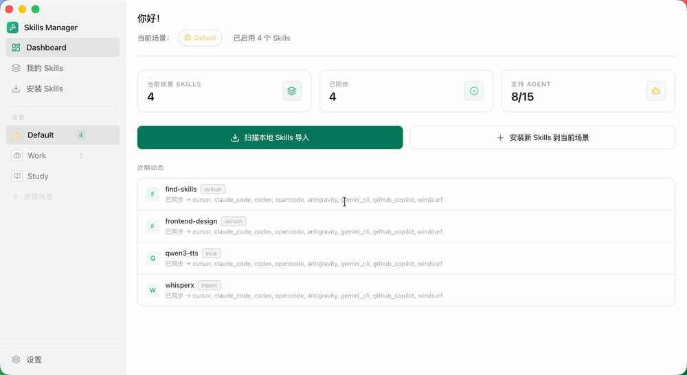

<p align="center">
  
</p>

<h1 align="center">Skills Manager</h1>

<p align="center">
  一个应用，统一管理所有 AI 编码工具的 Skills。
</p>

<p align="center">
  <a href="./README.md">English</a>
  &nbsp;·&nbsp;
  <a href="https://github.com/rendigua/skills-manager-optimize">Fork 仓库</a>
</p>

<p align="center">
  
</p>

| 我的 Skills | 项目 Skills |
|:-----------:|:----------:|
|  |  |

## 功能

- **统一技能库** — 从 Git 仓库、本地目录、`.zip` / `.skill` 文件或 [skills.sh](https://skills.sh) 市场安装技能，统一存放在 `~/.skills-manager`。
- **多工具同步** — 一键将技能同步到任意支持的工具，支持软链接和复制两种模式。
- **项目 Skills** — 查看并管理任意项目的 `.claude/skills/` 目录，支持与中央库双向同步。
- **场景管理** — 将技能分组为场景（Scenario），随时切换。
- **技能标签** — 为技能添加标签并按标签筛选，快速定位。
- **更新检查** — 为 Git 类技能检查远端更新；本地技能支持重新导入。
- **来源元数据** — 已安装技能会携带 `origin.json`，让来源、置信度和更新资格在同步、重建和迁移后仍然可追踪。
- **文档预览** — 直接在应用内查看 `SKILL.md` / `README.md`。
- **Git 备份** — 用 Git 管理技能库，支持版本控制和多机同步。

## 来源元数据

Skills Manager 将 `origin.json` 视为技能来源的文件侧真相。

- Git 安装会写入“已确认上游”来源。
- 市场安装会写入“已确认分发来源”，并记录用于后续更新的 GitHub 真源。
- 本地导入默认进入 `custom-no-source`，直到 resolver 确认真实上游。
- Agent 生成的 skill 也会写入 `origin.json`，默认是 `manual + custom-no-source`，除非显式绑定真实上游。
- 来源解析默认优先 `skills.sh`，只有在设置了 `skillsmp_api_key` 或环境变量 `SKILLSMP_API_KEY` 时才会启用 `SkillsMP`。
- `SkillsMP` 只作为分发证据，不替代 GitHub 真源。
- 批量回填只会自动应用无歧义强匹配，模糊项会保留给人工复核。

这套设计刻意区分两层语义：

- `provenance`：这个 skill 是怎么来的
- `update source`：后续应该跟谁比对更新

如果某个 skill 还没有确认真实上游，它依然可以被管理和同步，但不会得到可靠的自动更新结果。

## Git 备份

将 `~/.skills-manager/skills/` 备份到 Git 仓库，用于版本管理和多机同步。

### 快速配置

1. 创建一个私有仓库（推荐）。
2. 打开 **设置 → Git 同步配置**，保存远程仓库地址。
3. 打开 **我的 Skills** 页面。
4. 二选一：
- 已有远程仓库：点击 **开始备份**，按已配置地址克隆。
- 首次本地初始化：点击 **开始备份** 初始化本地仓库，再使用 **同步到 Git**。
5. 在我的 Skills 顶部工具栏点击 **同步到 Git**。

`同步到 Git` 会根据仓库状态自动处理拉取/提交/推送。
每次同步成功会自动创建一个快照版本标签。你可以在我的 Skills 中打开 **版本历史**，并将任意快照恢复为一条新的提交。

### 认证说明

- SSH 地址（`git@github.com:...`）：需要先在本机配置 SSH Key，并将公钥添加到 GitHub。
- HTTPS 地址（`https://github.com/...`）：推送通常需要 Personal Access Token（PAT）。

> **注意：** SQLite 数据库（`~/.skills-manager/skills-manager.db`）不纳入 Git 管理，它存储的元数据可通过扫描技能文件重建。

## 支持的工具

Cursor · Claude Code · Codex · OpenCode · Amp · Kilo Code · Roo Code · Goose · Gemini CLI · GitHub Copilot · Windsurf · TRAE IDE · Antigravity · Clawdbot · Droid

## 技术栈

| 层 | 技术 |
|----|------|
| 前端 | React 19、TypeScript、Vite、Tailwind CSS |
| 桌面 | Tauri 2 |
| 后端 | Rust |
| 存储 | SQLite（`rusqlite`） |
| 国际化 | react-i18next |

## 快速开始

### 前置依赖

- Node.js 18+
- Rust 工具链
- 当前系统的 [Tauri 依赖](https://v2.tauri.app/start/prerequisites/)

### 开发

```bash
npm install
npm run tauri:dev
```

### 构建

```bash
npm run tauri:build
```

## 常见问题

### macOS 提示"应用已损坏，无法打开"

下载应用后如果出现此提示，在终端执行以下命令后重新打开即可：

```bash
xattr -cr /Applications/skills-manager.app
```

如果 `.app` 不在 `/Applications`，请替换为实际路径。

## License

MIT
